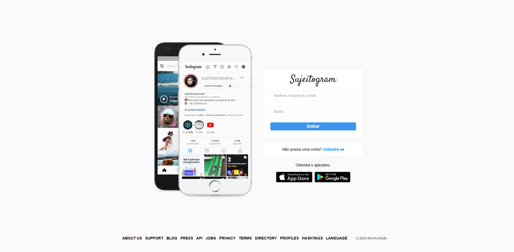
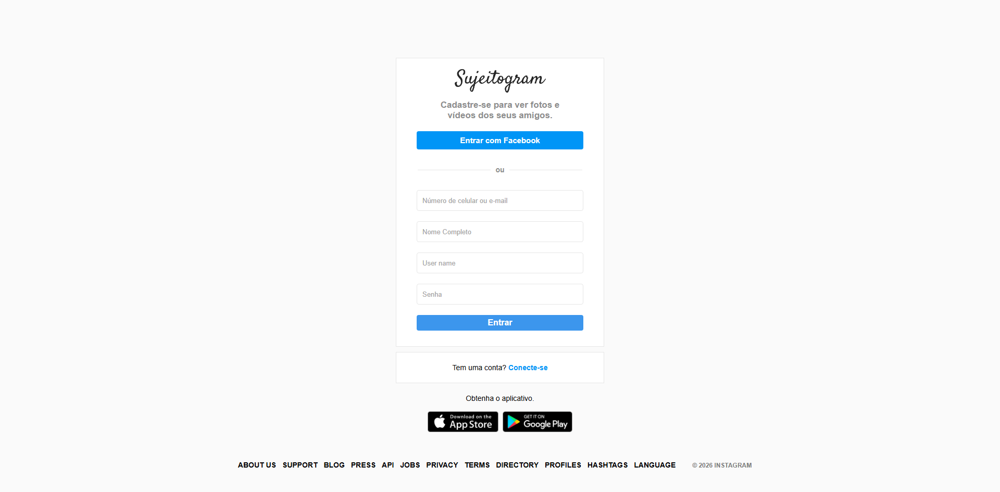

# Sujeitogram - Sua rede social
Neste projeto, foi possível praticar HTML e CSS, além de praticar também a responsividade da página para se adaptarem tanto em Desktop e Mobile.

Também foi possível adquirir novas conhecimentos com o Git e Vercel.

## Tecnologias utilizadas no projeto

    
    

## Ferramentas

## Acesse aqui - Deploy
Link do Deploy:  

