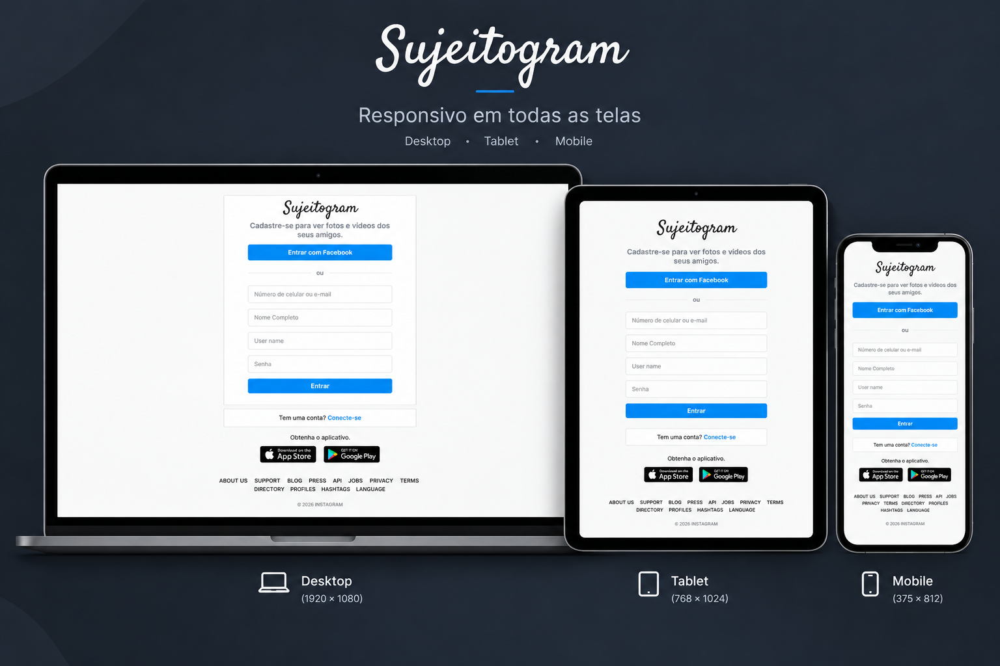

# 📱 Sujeitogram — Sua rede social

O **Sujeitogram** é um projeto desenvolvido para praticar e aprimorar conhecimentos em **HTML e CSS**, com foco na criação de uma interface moderna, responsiva e adaptável a diferentes tamanhos de tela.

Durante o desenvolvimento, também foi possível colocar em prática conceitos de **responsividade**, além de adquirir experiência com **Git** e realizar o **deploy da aplicação utilizando a Vercel**.

## 🚀 Tecnologias utilizadas

    
    

## 🛠️ Ferramentas

    
    

## 🌐 Deploy

Acesse o projeto online:

## 🖥️ Demonstração
### Responsividade

